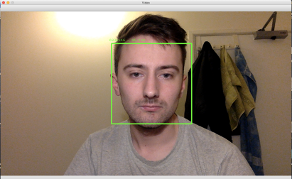

# Facial attendance system

The purpose of the facial recognition system is to improve the speed of the attendance registry by automatically recognising students' faces as they enter the classroom. 

The system is trained using the PCA and LDA algorithms. It captures a set of pictures of an individual in front of the camera (if more faces are detected, the closest one is used for training). The number of pictures can be changed in recog_PCA_LDA.py by altering the NUM_TRAINING variable. Once a face is detected, it will be surrounded with a blue frame with the number of pictures taken and the number of pictures that needs to be taken displayed above the frame.

  

The trained images will be saved in the folder with the ID of the individual provided by the user and the database updated with the individual's ID No. Subsequently, the pictures are used for training the PCA and LDA algorithms. Faces recognised by the program are surrounded with a green frame whilst detected but not recognised faces are surrounded with a red frame. The confidence level of each of the algorithms are displayed above the frame along with the ID No. of the recognised individuals. If a face is detected but not recognised, the individual will be recognised as "Unknown". 

  

The recognised individuals will have their attendance records automatically updated by the system. The database for this project consists of 2 tables used for recording the students' attendance as well as the student details. Both tables can be easily modified to store more details about the entities.

  

The main GUI consists of 2 buttons used for adding individuals to the database and verifying the attendance in real-time.

  

## Instruction of use

Before using the system, please create "face_data" folder in the main directory of the system. This folder is used to store individuals' faces captured during the training process.

Training
1. Run the system by launching gui_face.py
2. Insert the ID number of the individual in the first text area
3. Press "Add student" and wait until the set of pictures is taken. The individual should present the face in different expressions
4. Press "q" once the training is finished

Recognising
1. Run the system by launching gui_face.py
2. Insert the ID number of the classroom in the second text area
3. Press "Verify attendance". Faces of the recognied individuals will be matched with the data stored within the system and the attendance marked appropriately
4. Press "q" once the recognition is finished
